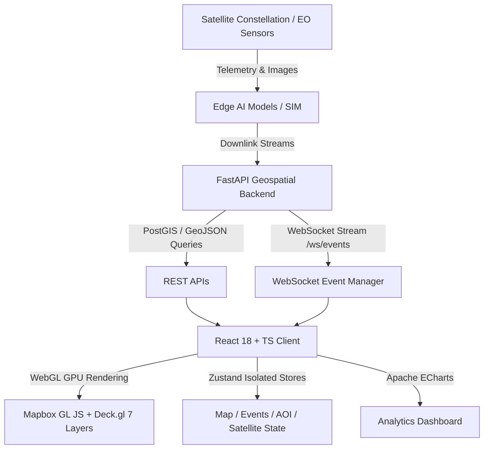

# 🇮🇳 BharatEye — India GeoAI Intelligence & Earth Observation Platform

A production-quality geospatial intelligence web application built to demonstrate Earth Observation (EO) derived insights, disaster monitoring, flood detection, crop stress analysis, forest fire observation, maritime surveillance, port congestion, and satellite edge AI inference workflows.

---

> [!IMPORTANT]
> **SIMULATION & PORTFOLIO DISCLAIMER**:
> This project is a portfolio/demo implementation. Satellite telemetry, onboard processing, vessel observations, and certain intelligence streams are simulated unless explicitly identified as public/authorized datasets. BharatEye does not communicate with or control real satellites.

---

## 🌟 Key Features

* **Interactive Dark India Map**: Centered on India with Mapbox GL JS & Deck.gl 7 GPU-accelerated WebGL layers (Events, Heatmap, Risk, AOIs, Satellite Footprints, Vessels, Tracks).
* **Area of Interest (AOI) Analysis**: Select region, satellite sensor (SAR, Optical, Multispectral, Thermal), and execute animated step-by-step GeoAI inference pipeline.
* **Real-time Event Feed & Alerts**: Filterable stream of floods, forest fires, crop stress, infrastructure changes, and maritime anomalies with map `flyTo` navigation.
* **Satellite Constellation & Edge AI**: Telemetry monitoring of simulated ISRO/EO satellites (EOS-04, Cartosat-3, Resourcesat-2A, Oceansat-3, INSAT-3DR) with onboard CPU/Memory resource gauges and Edge model latency metrics.
* **Apache ECharts Analytics**: 24-hour event timeline, state-level risk distribution, category breakdowns, and neural inference latencies.
* **Developer Performance Monitor**: FPS counter, entity counts (10,000+), visible layer stats, and rendering benchmarks.

---

## 🛠 Technology Stack

### Frontend
- **Framework**: React 18, TypeScript, Vite
- **Geospatial & WebGL**: Mapbox GL JS (`v3.2.0`), Deck.gl (`v9.0.0`)
- **State Management**: Zustand (Isolated stores: `mapStore`, `eventStore`, `aoiStore`, `satelliteStore`, `uiStore`)
- **Data Fetching & Routing**: TanStack Query (`v5`), Axios, React Router DOM
- **Analytics & Styling**: Apache ECharts (`echarts-for-react`), Tailwind CSS, Lucide React Icons

### Backend
- **Framework**: FastAPI (Python 3.14+)
- **Schemas & WebSockets**: Pydantic v2, Async WebSockets (`/ws/events`)
- **Spatial Simulation**: PySim Engine generating 10,000+ spatial entities & 100,000+ GeoJSON features clustered in Indian territory.

---

## 📐 Architecture Diagram



---

## 🚀 Quick Start (Local Development)

### 1. Run Frontend
```bash
cd frontend
npm install
npm run dev
```
Open [http://localhost:3000](http://localhost:3000)

### 2. Run Backend
```bash
cd backend
pip install -r requirements.txt
uvicorn app.main:app --reload --port 8000
```
Open API docs at [http://localhost:8000/docs](http://localhost:8000/docs)

### 3. Run with Docker Compose
```bash
docker-compose up --build
```

---

## 🧪 Testing & Verification

```bash
cd frontend
npm run build
```

---

## 🚀 Deploying Publicly

### Backend on Render
1. Create a new Render Web Service from this repository.
2. Use the `backend` folder as the root directory.
3. Set the build command to `pip install -r requirements.txt`.
4. Set the start command to `uvicorn app.main:app --host 0.0.0.0 --port $PORT`.
5. Add an environment variable:
   - `FRONTEND_ORIGIN` = your Vercel site URL, for example `https://bharateye.vercel.app`
6. Deploy and copy the live backend URL.

### Frontend on Vercel
1. Create a new Vercel project from this repository.
2. Set the root directory to `frontend`.
3. Add environment variables:
   - `VITE_MAPBOX_TOKEN` = your public Mapbox token
   - `VITE_API_URL` = your Render backend URL, for example `https://bharateye-backend.onrender.com`
4. Deploy the site.

### Quick checks after deploy
1. Open the Vercel site and confirm the dashboard loads.
2. Visit the backend `/docs` page and confirm the API is live.
3. Test one API call from the frontend and make sure the browser console shows no CORS errors.

---

## Portfolio Entry

If you want to add this to a portfolio site, a clean summary is:

**BharatEye** - India-focused GeoAI and Earth Observation dashboard built with React, Vite, FastAPI, Deck.gl, Mapbox GL JS, and ECharts. Features simulated satellite intelligence, AOI analysis, live event monitoring, and geospatial analytics.

---

## 📄 License
MIT License. Created for Geospatial / Frontend Developer Portfolio Demonstration.
