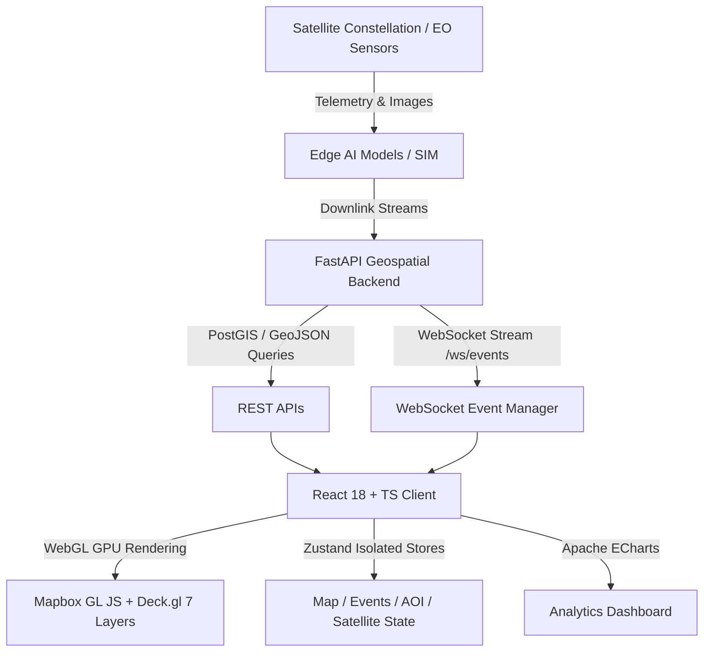

# 🇮🇳 BharatEye System Architecture

## Overview
BharatEye is a production-grade geospatial intelligence platform designed for monitoring India through Earth Observation (EO) insights, disaster event detection, agricultural stress tracking, forest fire observation, and maritime analysis.

## Frontend Technical Architecture
- **Framework**: React 18, Vite, TypeScript
- **State Isolation**: Zustand (`mapStore`, `eventStore`, `aoiStore`, `satelliteStore`, `uiStore`)
- **GPU Geospatial Rendering**: `@deck.gl/core`, `@deck.gl/layers`, `@deck.gl/geo-layers`, `@deck.gl/react`
- **Base Maps**: Mapbox GL JS (`v3.2.0`)
- **Analytics**: Apache ECharts (`echarts-for-react`)
- **Styling**: Tailwind CSS with custom dark theme (`#06111F`, `#0B1726`)

## Backend Technical Architecture
- **Framework**: FastAPI (Python 3.14+)
- **Data Validation**: Pydantic v2 schemas
- **Spatial Simulation Engine**: `GeoSimulationEngine` generating 10,000+ entities & 100,000+ GeoJSON features clustered in Indian territory.
- **WebSockets**: Asynchronous `/ws/events` publisher with batch streaming capabilities.
